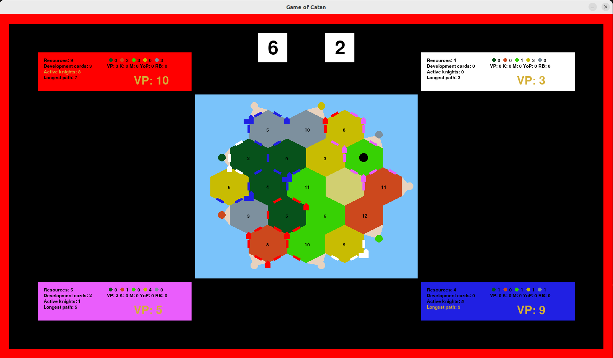

# Neural-Network-Catan
The settlers of Catan is a very popular board game based in building and colonizing the island of Catan. Created by Klaus Teuber, this game has sold millions of copies in more than 15 languages all over the world.

In this project, a simulation of the game is creted in order to provide a neural network the facilities to be trained to play the game and try to win the most games as possible. The project is divided in two parts, the training of the neural network and the execution of the game itself.



## Explanation of the proyect

The goal of this project is to:

* Build a simulator that can execute the game of catan and all variables and information are available to the player at any moment during the game.
* Create an artificial intelligence able to beat 3 players whose actions are chosen randomly.

For more information, read the paper located at the base directory of this repositoy.

## How to use the project

*This tutorial is for Linux users with python 3 installed*

First of all, clone this repository in your local machine.

```
git clone https://github.com/RubiMonti/Neural-Network-Catan.git
```

Afterwards, check if the modules needed are installed:
```
# Verify if it is installed
python3 -c "import tensorflow as tf; print(tf.config.list_physical_devices('GPU'))"
# If it is not installed, the following command must install the module
python3 -m pip install tensorflow
```

If it is up to date, everything is ready to run, access the repository and execute the following commands to execute the game with the trained agent:

```
cd Game
python3 catan.py
```

A window must pop up and the game shall begin. You can pause the game pressing the 'p' key and continue ir by pressing the same button again. When the game end, just close the window to end the program.
